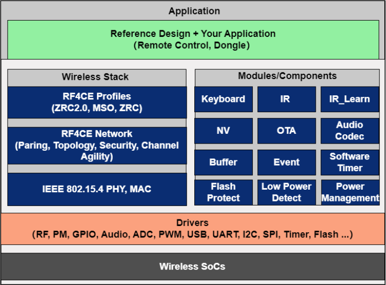

# telink_rf4ce_sdk README

* [中文版](./README_CN.md)

## SDK introduction

telink_rf4ce_sdk is an RF4CE software development platform based on Telink TLSR825x, TLSR827x, TLSR952x, and TL321x series SoCs. It supports RF4CE application layer protocols such as ZRC2 and MSO, and provides IR transmission, IR learning, audio, and OTA (over-the-air) features, helping you efficiently build RF remote control products.

RF4CE is an RF remote control protocol designed for consumer electronics, featuring non-line-of-sight control, two-way communication, ultra-low power consumption, and cross-brand interoperability.

This SDK provides a complete software system, including chip low-level drivers, adaptation layer drivers, the RF4CE protocol stack, and a rich set of example projects (covering both remote control and receiver projects), fully supporting the entire development cycle from product prototyping to mass production deployment.

**Core capabilities**

| Category | Capability |
| --- | --- |
| Wireless connectivity | Supports the RF4CE protocol stack with IEEE 802.15.4 as the underlying protocol, and RF4CE application layer protocols such as ZRC2 and MSO |
| Software framework | Provides standardized peripheral drivers, security components, and common IR code transmission examples; adopts a modular layered design for easy feature extension and maintenance |
| System services | Integrates clock management, event scheduling, power management, non-volatile (NV) storage management, and OTA firmware upgrade management, ensuring efficient and stable system operation |
| Example projects | Typical reference projects such as the remote control (RC) and the receiver (Dongle) |

**Typical applications**

| Wireless technology | Application field | Typical products |
| --- | --- | --- |
| RF4CE (based on IEEE 802.15.4) | Consumer electronics | RF remote controls for TVs and set-top boxes, learning remote controls, IR + RF remote controls, etc. |
|  | Smart home | Smart home hub remote controls, all-in-one remote controls, etc. |

**Support information**

For complete and accurate details on chip series, corresponding development boards, development platforms, toolchains, and SDK versions, refer to the [Release Notes](./doc/telink_rf4ce_sdk_Release_Note.md).

## Documentation and resources

**Documentation navigation**

| Document | Description |
| --- | --- |
| [Getting Started](https://doc.telink-semi.cn/doc/en/software/res/sdk/rf4ce/get_started/telink_rf4ce_sdk_getting_started_en/) | Development environment setup, SDK acquisition, and quick start instructions |
| [Release Notes](./doc/telink_rf4ce_sdk_Release_Note.md) | Supported platforms, version notes, and detailed changes |

**Community and resources**

| Resource | Description |
| --- | --- |
| [Telink official forum](https://forum.telink-semi.cn/) | Technical support and discussions |
| [Telink official website](https://www.telink-semi.com/) | Product and documentation center |
| [GitHub](https://github.com/telink-semi/telink_rf4ce_sdk) / [Gitee](https://gitee.com/telink-semi/telink_rf4ce_sdk) | SDK source code repositories |

## License

This project is released under the following license:

**Apache License, Version 2.0**

Licensed under the Apache License, Version 2.0 (the "License"); You may not use this file except in compliance with the License.

You may obtain a copy of the License at: [http://www.apache.org/licenses/LICENSE-2.0](http://www.apache.org/licenses/LICENSE-2.0)

Unless required by applicable law or agreed to in writing, software distributed under the License is distributed on an "AS IS" BASIS, WITHOUT WARRANTIES OR CONDITIONS OF ANY KIND, either express or implied.

See the License for the specific language governing permissions and limitations under the License.
